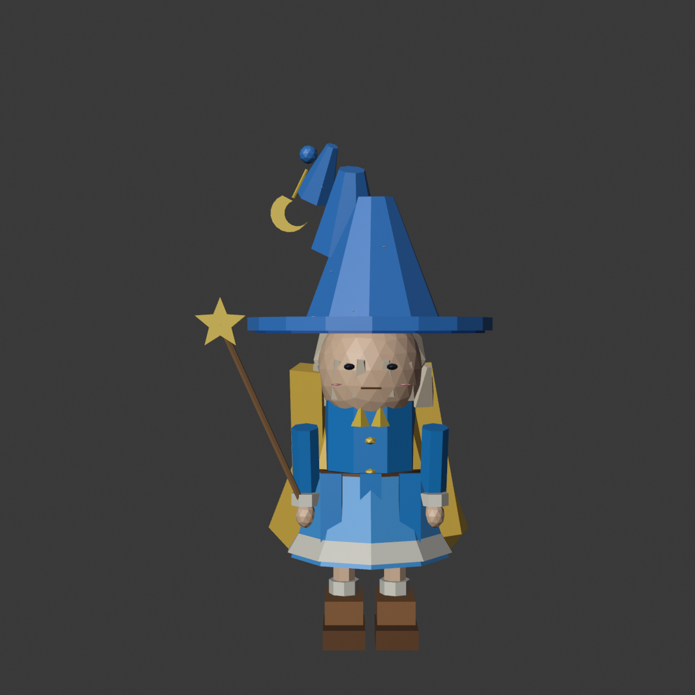
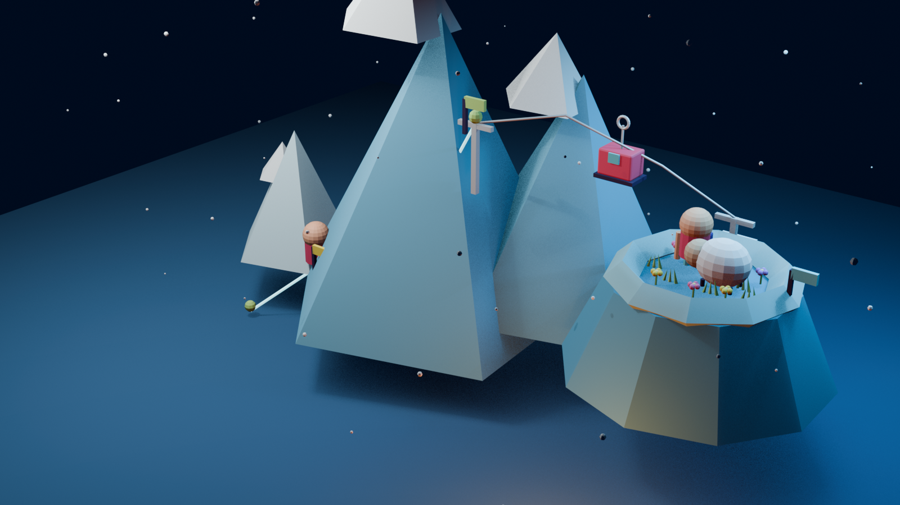

# Snowline Home 3D

一个以“巫师女孩的雪山旅程”为叙事线索的交互式 3D 个人主页。

玩家会沿着星光雪线攀上山顶，乘坐缆车越过群峰，在月光牧场与小羊相遇，最后抵达篝火与星空下的终点。作品把个人主页的信息结构融入一段可探索的微型冒险，让“作品、关于、经历和联系”不再只是静态栏目，而是旅程中的章节与目的地。

[在线体验](https://riyata.github.io/personal-home-3d01/) · [GitHub Pages](https://riyata.github.io/personal-home-3d01/)

项目基于 React、Three.js、React Three Fiber 和 Drei 开发，使用 Blender 制作并拆分低多边形 GLB 模型，通过 Three.js 状态机驱动场景切换、角色移动、缆车旅程和轻量姿态动画。

## 项目截图

### 巫师女孩

<p align="center">
  
</p>

蓝色尖帽、星星法杖与金色披风构成主角的核心视觉识别。角色采用低多边形造型，并预留手脚节点供网页端控制攀登、移动和互动姿态。

### 雪线世界



场景由雪山攀登路线、山顶缆车和火山口牧场串联而成。冷蓝色雪峰与暖色角色、花草和缆车形成对比，共同构成带有童话感的夜间冒险世界。

## 运行

```bash
npm install
npm run dev
```

## 操作

- `↑`：沿路线向上攀登
- `↓`：沿路线后退
- `←` / `→`：在登山路线两侧移动
- `Enter` / `Space`：乘坐缆车、给羊喂草
- 移动端：使用右下角触控方向键和互动键

## 当前流程

1. 沿雪线爬到山顶。
2. 按 `Enter` 乘坐缆车。
3. 到达牧场后按 `Enter` 给羊喂草。
4. 场景自动切换到夜晚篝火和星空。

## 节点图标

底部选关栏预留了五个图标插槽：

- `data-icon-slot="base"`：山脚
- `data-icon-slot="summit"`：山顶
- `data-icon-slot="cable"`：缆车
- `data-icon-slot="meadow"`：牧场
- `data-icon-slot="camp"`：篝火

将对应 `.checkpoint-icon` 内的编号占位替换为 SVG 或图片即可，节点跳转逻辑无需修改。

## 模型资产

Blender 源文件和导出脚本位于 `blender/`：

- `blender/build_web_models.py`：按参考图生成低多边形模型并导出 GLB。
- `blender/snowline_web_models.blend`：可打开继续编辑的 Blender 场景。
- `blender/snowline_web_models_preview.png`：Blender 预览图。

网页加载的模型位于 `public/models/`：

- `environment.glb`：雪山、云、路线、山顶平台和缆绳。
- `meadow.glb`：火山口牧场、草地、小花和台阶。
- `climber.glb`：巫师女孩角色，含可被 Three.js 控制的手脚节点。
- `sheep.glb`：低多边形羊，含可被 Three.js 控制的头部和草束节点。
- `cable-car.glb`：红色缆车。
- `camp.glb`：篝火、木柴和石头。

## 后续内容

- 将角色姿态升级为 Blender 动画片段，如 `Climb`、`FeedGrass`、`Sleep`。
- 将作品、关于、经历、联系方式绑定到路线站点。
- 增加真实个人文案、项目详情和外部链接。
- 补充音效、背景音乐和加载进度。
